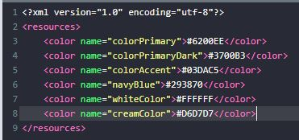

# 01 - Tugas 10 - CONSTRAINT LAYOUT - BASIC VIEW POSITION

## Tujuan Pembelajaran

1. Mahasiswa tahu bagaimana mengatur view dalam constraint layout.

## Hasil Praktikum

1. Buka tab strings.xml.

2. Tambahkan sumber daya string seperti yang dijelaskan di bawah. Anda bebas mengatur harga pada 'buy_button' dan menentukan isi teks dari 'contentText' .
Template: <string name="string-name">string-value</string>

3. Buka tab colors.xml

4. Tambahkan sumber daya color seperti yang dijelaskan di bawah.
Template: <color name="color-name">color-value</color>

5. Buka tab activity_main.xml.

6. Buat sebuah ConstraintLayout dengan id “componentActivity” sebagai layout utama. Gunakan template di bawah untuk membuat sebuah ConstraintLayout dan tambahkan android namespace di bawah ini untuk menyediakan namespace ‘app' yang akan digunakan semua view. Lalu tambahkan atributnya.

7. Di dalam tag Constraint Layout utama, Buat sebuah Button dengan id “sampleButton”. Button ini untuk mengarahkan ke halaman buku contoh. lalu tambahkan atributnya. Beri atribut untuk menentukan posisi view ini pada Constraint Layout.

8. Tambahkan Button dengan id “buyButton” di samping “sampleButton” menggunakan ‘start to end of’. Button ini untuk mengarahkan ke halaman pembayaran. Kemudian tambahkan atributnya.

9. Tambah View dengan id “divider” di bawah “sampleButton” menggunakan ‘top to bottom of’. View ini untuk memisahkan tombol dari teks deskripsi. Kemudian tambahkan atributnya.

10. Tambahkan TextView dengan id “descriptionTextView” di bawah “divider” menggunakan ‘top to bottom of’. TextView ini untuk menampilkan teks deskripsi. Kemudian tambahkan atributnya.

11. Lakukan Submit !

12. Dapatkan hasil dari pengerjaan. Jika berhasil, anda akan mendapat status PASSED. Jika gagal, anda akan mendapat status ERROR atau FAILED. Lihat dan cek validation detail dan teruslah mencoba.

