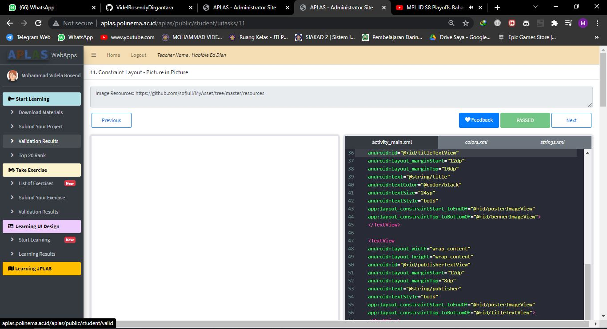

# 01 - Tugas 10 - CONSTRAINT LAYOUT - PICTURE IN PICTURE

## Tujuan Pembelajaran

1. Mahasiswa tahu bagaimana menampilkan gambar dari image resources menggunakan imageview .

## Hasil Praktikum

1. Buka tab strings.xml.

2. Ubah judul aplikasi menjadi 'Picture in Picture'. Buat string resources untuk menyimpan judul film dan penerbitnya. Anda bebas menentukan judul dan penerbitnya.
Template: <string name="string-name">string-value</string>

3. Buka tab colors.xml.

4. Tambah warna hitam ke color resources seperti yang dijelaskan di bawah.
Template: <color name="color-name">color-value</color>

5. Buka tab activity_main.xml.

6. Buat ConstraintLayout dengan id "pictureActivity" sebagai layout utama. Gunakan template di bawah untuk membuat sebuah ConstraintLayout dan tambahkan android namespace di bawah ini untuk menyediakan namespace ‘app' yang akan digunakan semua view. Lalu tambahkan atributnya

7. Di dalam proyek ini, ada 2 image resources telah disediakan, 'aladin_benner.jpeg' untuk benner dan 'aladin_poster.jpeg' untuk poster. Pertama kita membuat ImageView dengan id 'bennerImageView' di dalam tag layout utama untuk menampilkan 'aladin_benner.jpeg'. Buat sisi kiri, atas, dan kanan ImageView terpasang ke parent. Kemudian tambahkan atributnya.

8. Tambahkan ImageView kedua dengan id ‘posterImageView' untuk menampilkan 'aladin_poster.jpeg'. Kita akan menempatkan ImageView ini di atas 'bennerImageView'. Inilah yang disebut  'picture in picture'. Buat isi kiri, atas, dan kanan ImageView terpasang ke parent.

9. Tambahkan TextView dengan id 'titleTextView' untuk menampilkan judul buku. Tempatkan TextView ini di samping 'posterImageView', di bawah 'bennerImageView'

10. Tambahkan TextView dengan id ‘publisherTextView' untuk menampilkan nama penerbit. Tempatkan TextView ini di samping 'posterImageView', di bawah 'titleTextView'.

11. Lakukan Submit !

12. Dapatkan hasil dari pengerjaan. Jika berhasil, anda akan mendapat status PASSED. Jika gagal, anda akan mendapat status ERROR atau FAILED. Lihat dan cek validation detail dan teruslah mencoba.

