# 01 - Tugas 12 - CONSTRAINT LAYOUT - EBOOK STORE

## Tujuan Pembelajaran

1. Mahasiswa mengetahui cara membuat halaman aplikasi toko buku elektroik modern.

## Hasil Praktikum

1. Buka tab strings.xml.

2. Ubah judul aplikasi menjadi ‘Book Store’. Buat string resources untuk menyediakan teks yang dibutuhkan oleh aplikasi. Anda bebas menentukan nilai string dalam aplikasi ini. Buat sesuai keinginan Anda. Tapi tidak apaapa jika Anda mengikuti tabel di bawah ini.
Template: <string name="string-name">string-value</string>

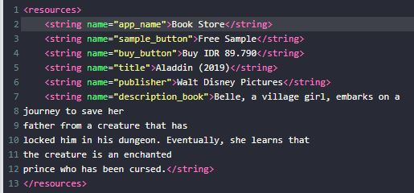

3. Buka tab colors.xml.

4. Tambahkan warna yang dibutuhkan ke color resources seperti yang dijelaskan di bawah ini.
Template: <color name="color-name">color-value</color>

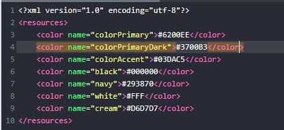

5. Buka tab activity_main.xml.

6. Buat ConstraintLayout dengan id “eBooktoreActivity” sebagai layout utama. Gunakan template di bawah untuk membuat sebuah ConstraintLayout dan tambahkan android namespace di bawah ini untuk menyediakan namespace ‘app' yang akan digunakan semua view. Lalu tambahkan atributnya.

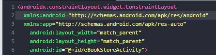

7. Buat ImageView dengan id ‘bennerImageView’ di dalam tag tata letak utama untuk menampilkan ‘aladin_benner.jpeg’. Buat sisi kiri, atas, dan kanan ImageView terpasang ke parent. Kemudian tambahkan atributnya

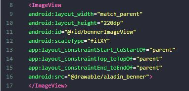

8. Tambahkan ImageView kedua dengan id ‘posterImageView 'untuk menampilkan' aladin_poster.jpeg '. Kita akan menempatkan ImageView ini di atas 'bennerImageView'. Inilah yang disebut 'picture in picture'. Buat sisi kiri, atas, dan kanan ImageView terpasang ke parent.

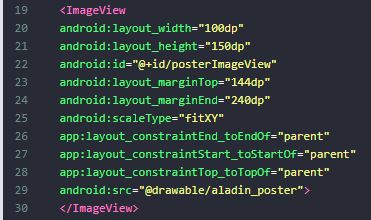

9. Tambahkan TextView dengan id 'titleTextView' untuk menampilkan judul buku. Tempatkan TextView ini di samping 'posterImageView', di bawah 'bennerImageView'.

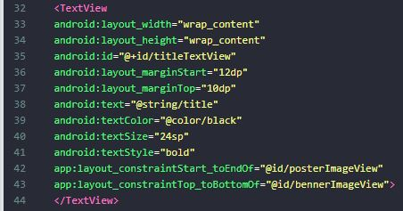

10. Tambahkan TextView dengan id 'publisherTextView' untuk menampilkan nama penerbit. Tempatkan TextView ini di samping 'posterImageView', di bawah 'titleTextView' .

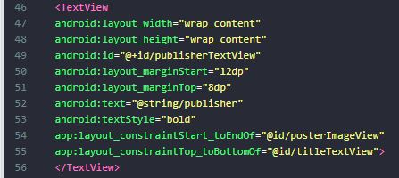

11. Tambahkan Button dengan id "sampleButton". Button ini untuk menavigasi ke halaman buku contoh. Kemudian tambahkan atributnya. Beri atribut untuk menentukan posisi tampilan ini pada tata letak batasan.

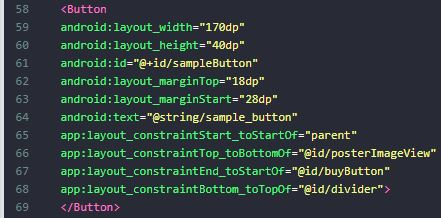

12. Tambahkan Button dengan id "buyButton" di samping "sampleButton" menggunakan ‘Start to End of'. Button ini untuk mengarahkan ke halaman pembayaran. Kemudian tambahkan atributnya

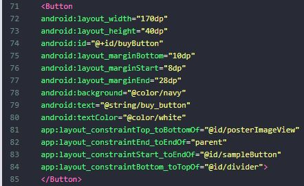

13. Tambahkan View dengan id "divider" di bagian bawah "sampleButton" menggunakan 'top to bottom of'. View ini untuk memisahkan tombol dari teks deskripsi. Kemudian tambahkan atributnya.

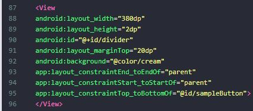

14. Tambahkan TextView dengan id "TextView deskripsi" di bagian bawah "pembagi" menggunakan 'top to bottom of'. TextView ini untuk menampilkan deskripsi teks. Kemudian tambahkan atributnya.

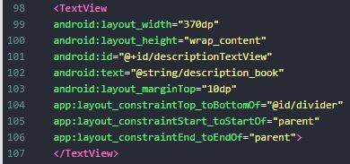

15. Lakukan Submit !

16. Dapatkan hasil dari pengerjaan. Jika berhasil, anda akan mendapat status PASSED. Jika gagal, anda akan mendapat status ERROR atau FAILED. Lihat dan cek validation detail dan teruslah mencoba.

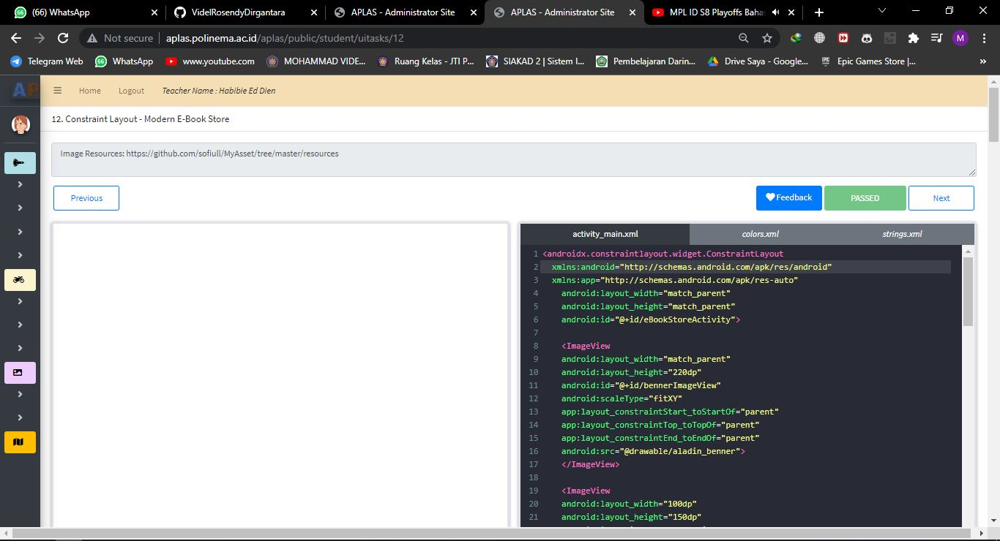