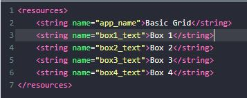
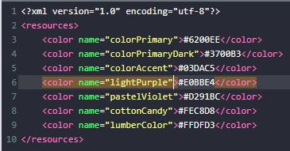
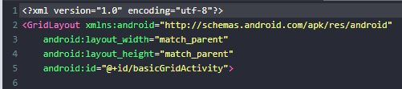
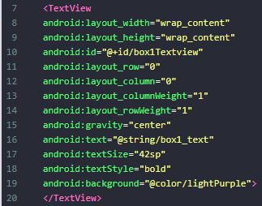
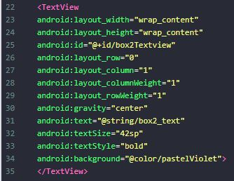
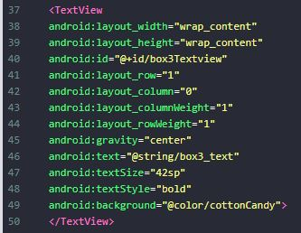
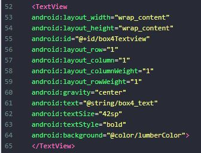
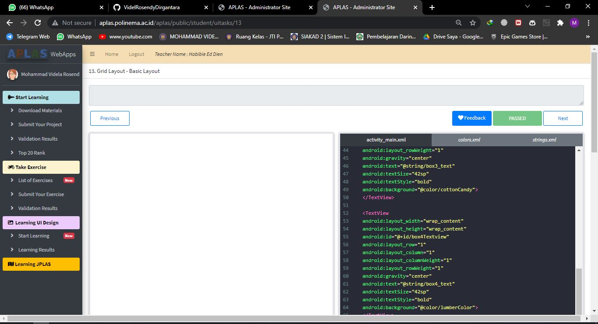

# 01 - Tugas 13 - CONSTRAINT LAYOUT - BASIC GRID

## Tujuan Pembelajaran

1. Mahasiswa mengetahui cara membuat halaman aplikasi toko buku elektroik modern.

## Hasil Praktikum

1. Buka tab strings.xml.

2. Ubah judul aplikasi menjadi ‘Basic Grid’. Tambahkan string yang diperlukan ke string resources seperti yang dijelaskan di bawah ini
Template: <string name="string-name">string-value</string>

3. Buka tab colors.xml.

4. Tambahkan warna yang diperlukan ke color resources seperti yang
dijelaskan di bawah ini.
Template: <color name="color-name">color-value</color>

5. Buka tab activity_main.xml.

6. Buat sebuah GridLayout dengan id “basicGridActivity” sebagai layout utama, lalu tambahkan atributnya.

7. Buat sebuah TextView dengan id ‘box1Textview’ di dalam tag layout utama. Atur posisi pada ‘row index = 0’ dan ‘column index = 0’. Index berguna sebagai urutan. Dimulai dari 0. Atur Column dan Row Weight menjadi 1. Ini berguna untuk Ini berguna untuk menyesuaikan porsi tampilan ke ruang yang ada secara otomatis. Lalu tambahkan atributnya.

8. Tambahkan TextView dengan id ‘box2Textview’. Atur posisi pada ‘row index = 0’ and ‘column index = 1’. Atur Column dan Row Weight menjadi 1. Lalu tambahkan atributnya.

9. Tambahkan TextView dengan id ‘box3Textview’. Atur posisi pada ‘row index = 1’ and ‘column index = 0’. Atur Column dan Row Weight menjadi 1. Lalu tambahkan atributnya.

10. Tambahkan TextView dengan id ‘box3Textview’. Atur posisi pada ‘row index = 1’ and ‘column index = 1’. Atur Column dan Row Weight menjadi 1. Lalu tambahkan atributnya.

11. Lakukan Submit !

12. Dapatkan hasil dari pengerjaan. Jika berhasil, anda akan mendapat status PASSED. Jika gagal, anda akan mendapat status ERROR atau FAILED. Lihat dan cek validation detail dan teruslah mencoba.

