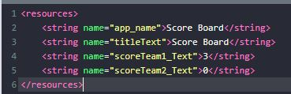
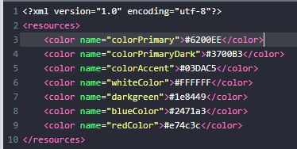
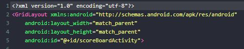
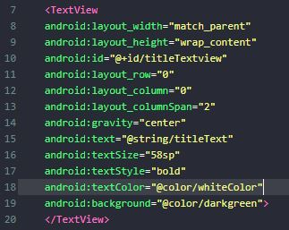
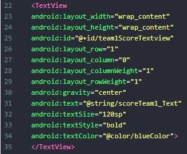
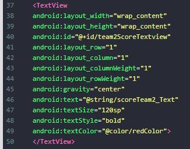
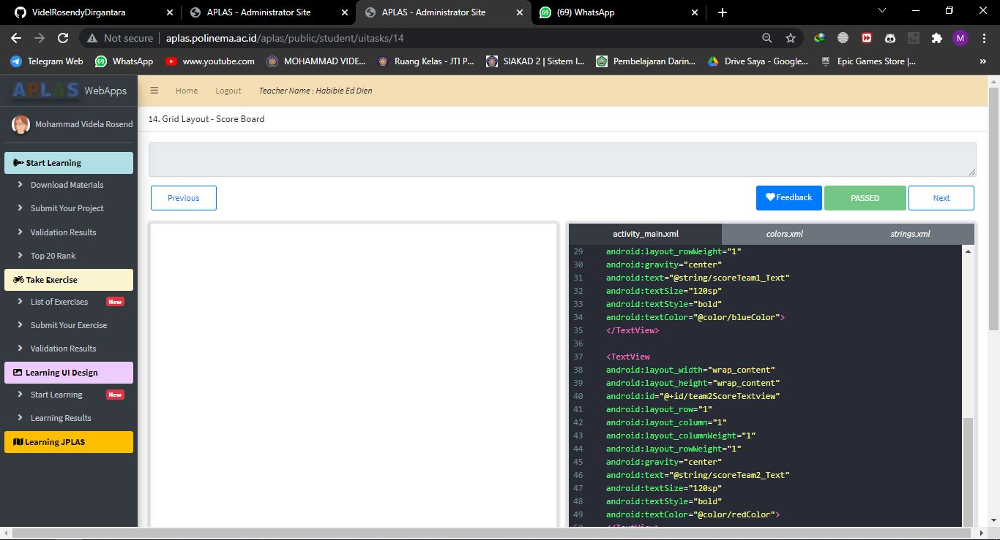

# 01 - Tugas 14 - CONSTRAINT LAYOUT - BASIC GRID

## Tujuan Pembelajaran

1. Mahasiswa mengetahui cara membuat papan skor dengan menggunakan grid layout.

## Hasil Praktikum

1. Buka tab strings.xml.

2. Ubah judul aplikasi menjadi ‘Score Board’. Tambahkan string yang diperlukan ke string resources seperti yang dijelaskan di bawah. Anda bebas menentukan nilai string. Tetapi tidak apa-apa jika Anda mengikuti tabel di bawah ini.
Template: <string name="string-name">string-value</string>

3. Buka tab colors.xml.

4. Tambahkan warna yang diperlukan ke color resources seperti yang dijelaskan di bawah ini.
Template: <color name="color-name">color-value</color>

5. Buka tab activity_main.xml.

6. Buat sebuah GridLayout dengan id “scoreBoardActivity” sebagai layout utama, lalu tambahkan atributnya.

7. Buat TextView dengan id ‘titleTextview’ di dalam tag layout utama. Atur posisi pada ‘row index = 0’ and ‘column index = 0’. Atur Column Weight titleText Score Board scoreTeam1_Text 3 scoreTeam2_Text 0 Color Name Color Value menjadi 2. Ini membuat TextView mengisi 2 kolom pada baris 0. Lalu tambahkan atributnya.

8. Tambah TextView dengan id ‘team1ScoreTextview. Atur posisi pada ‘row index = 1’ and ‘column index = 0’. Atur Column dan Row Weight menjadi 1. Lalu tambahkan atributnya

9. Tambah TextView dengan id ‘team2ScoreTextview. Atur posisi pada ‘row index = 1’ and ‘column index = 1’. Atur Column dan Row Weight menjadi 1. Lalu tambahkan atributnya.

10. Lakukan Submit !

11. Dapatkan hasil dari pengerjaan. Jika berhasil, anda akan mendapat status PASSED. Jika gagal, anda akan mendapat status ERROR atau FAILED. Lihat dan cek validation detail dan teruslah mencoba.

