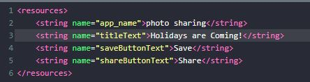
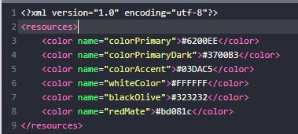
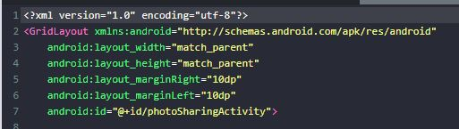
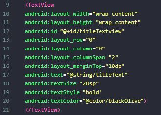
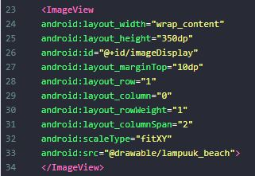
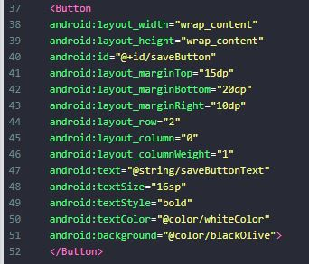
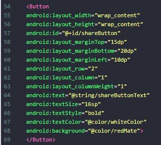
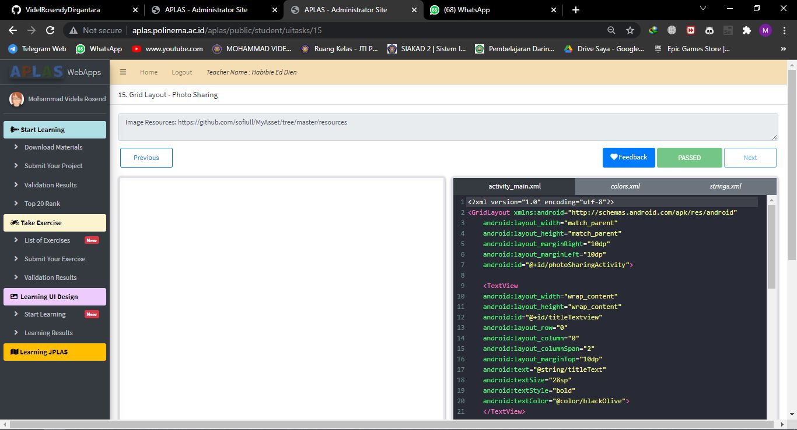

# 01 - Tugas 15 - CONSTRAINT LAYOUT - IMAGE SHARING

## Tujuan Pembelajaran

1. Mahasiswa mengetahui cara membuat aplikasi berbagi foto dengan menggunakan grid layout.

## Hasil Praktikum

1. Buka tab strings.xml.

2. Ubah judul aplikasi menjadi ‘photo sharing’. Tambah string yang dibutuhkan ke string resources seperti yang dijelaskan dibawah. Anda bebas menentukan nilai dari setiap string. Tetapi tidak mengapa jika anda mengikuti tabel di bawah ini.
Template: <string name="string-name">string-value</string>

3. Buka tab colors.xml.

4. Tambah warna yang dibutuhkan ke color resource sesuai yang dijelaskan dibawah.
Template: <color name="color-name">color-value</color>

5. Buka tab activity_main.xml.

6. Buat sebuah GridLayout dengan id “photoSharingActivity” sebagai layout utama, lalu tambahkan atributnya

7. Buat sebuah TextView dengan id ‘titleTextview’ di dalam tag layout utama. Atur posisi pada ‘row index = 0’ dan ‘column index = 0’. Atur Column Weight menjadi 2. Ini membuat TextView mengisi 2 columns di baris (index) 0. Lalu tambahkan atributnya.

8. Tambahkan ImageView dengan id ‘imageDisplay’ untuk menampilkan sebuah gambar. Atur posisi pada ‘row index = 1’ and ‘column index = 0’. Atur Row Weight menjadi 1 dan Column Span menjadi 2. Lalu tambahkan atributnya.

9. Tambahkan sebuah Button dengan id ‘saveButton’ untuk menyimpan gambar ke galery. Atur posisi pada ‘row index = 2’ dan ‘column index = 0’. Atur Column Weight menjadi 1. Lalu tambahkan atributnya.

10. Tambah Button dengan id ‘shareButton’ untuk membagikan gambar ini ke sosial media. Atur posisi pada ‘row index = 2’ and ‘column index = 1’. Atur Column Weight menjadi 1. Lalu tambahkan atributnya.

11. Lakukan Submit !

12. Dapatkan hasil dari pengerjaan. Jika berhasil, anda akan mendapat status PASSED. Jika gagal, anda akan mendapat status ERROR atau FAILED. Lihat dan cek validation detail dan teruslah mencoba.

