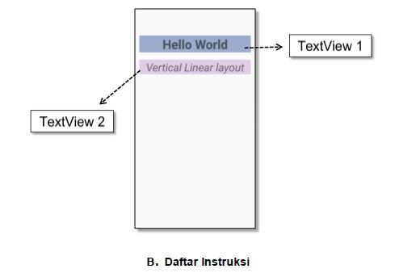
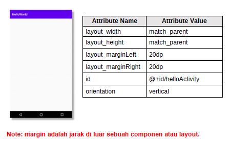
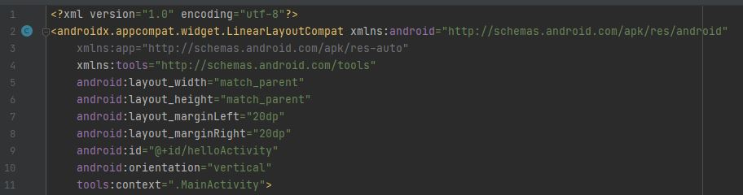
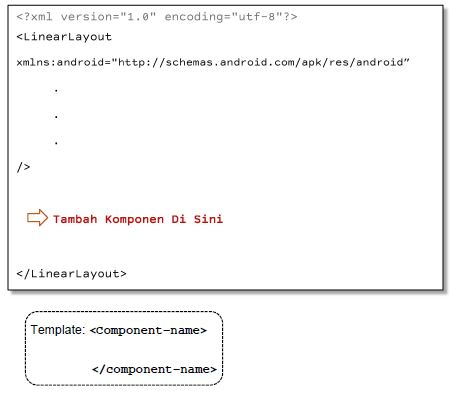
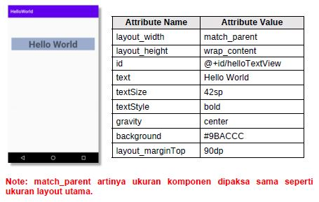
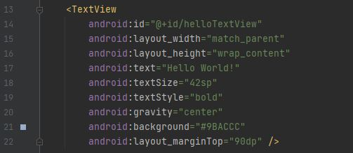
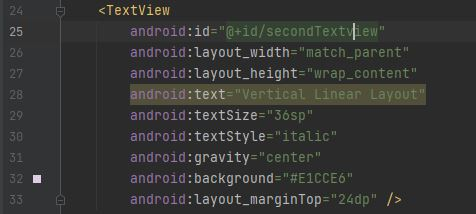
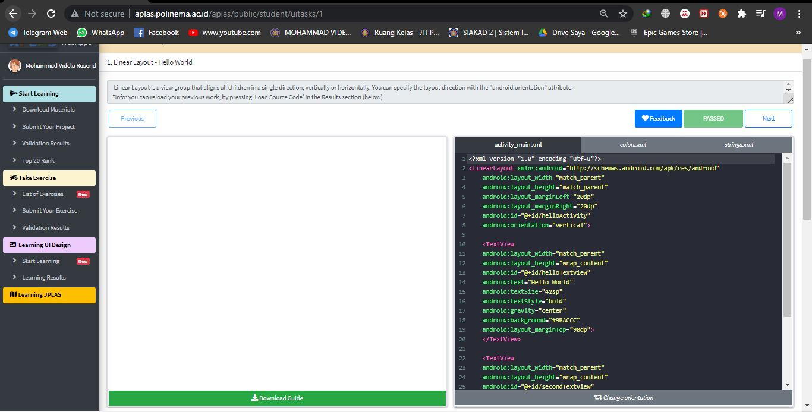
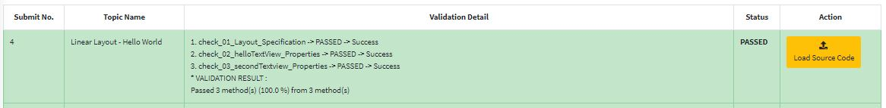
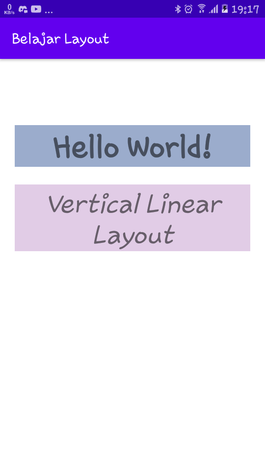

# 01_LINEAR LAYOUT - HELLO WORLD

## Tujuan Pembelajaran

1. Mahasiswa akan membuat halaman login sederhana menggunakan LinearLayout. 

## Hasil Praktikum

1. Buka tab activity_main.xml.

2. Buat sebuah vertikal LinearLayout dengan id “helloActivity” sebagai layout utama, lalu tambahkan atribut di dalamnya.

*Screenshot Source Code*

3. Di dalam tag Linear Layout utama, tambahkan sebuah TextView dengan id “helloTextView”. lalu tambahkan atribut di dalamnya.

*Screenshot Source Code*

4. Tambahkan satu lagi TextView dengan id “secondTextview”, Di dalam tag Linear Layout utama.

*Screenshot Source Code*

5. Lakukan Submit !

6. Dapatkan hasil dari pengerjaan. Jika berhasil, anda akan mendapat status PASSED. Jika gagal, anda akan mendapat status ERROR atau FAILED. Lihat dan cek validation detail dan teruslah mencoba

*Screenshot Hasil Running di HP*

