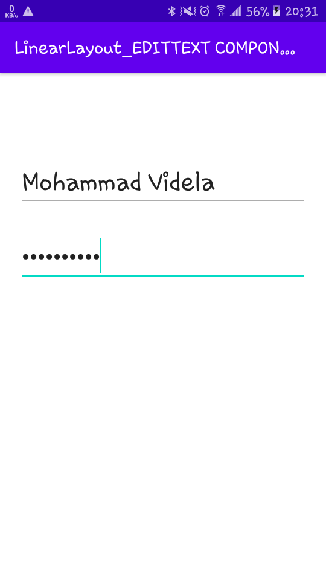

# 01 - Tugas 2 - LINEAR LAYOUT - EDITTEXT COMPONENTS

## Tujuan Pembelajaran

1. Mahasiswa mengetahui cara membuat komponen yang dapat menerima masukan dari pengguna dengan menggunakan EditText. Ini adalah dasar untuk membuat halaman yang membutuhkan masukan dari pengguna, seperti halaman login.

## Hasil Praktikum

B. Daftar Instruksi

1. Buka tab activity_main.xml.

2. Buat vertikal LinearLayout dengan id “editActivity” sebagai layout utama, lalu tambahkan atributnya.

*Screenshot Source Code*

3. Di dalam tag Linear Layout utama,tambah sebuah EditText dengan id “emailEditText”. lalu tambahkan atributnya

*Screenshot Source Code*

4. Tambahkan sebuah EdiText dengan id “passwordEditText”, di dalam tag Linear Layout utama.lalu tambahkan atributnya.

*Screenshot Source Code*

5. Lakukan Submit !

6. Dapatkan hasil dari pengerjaan. Jika berhasil, anda akan mendapat status PASSED. Jika gagal, anda akan mendapat status ERROR atau FAILED. Lihat dan cek validation detail dan teruslah mencoba

*Screenshot Hasil Running di HP*

