# 01 - Tugas 4 - NESTED COMPONENTS

## Tujuan Pembelajaran

1. Mahasisiwa mampu membuat komponen bersarang, horizontal linear layout pada vertikal linear layout. 

## Hasil Praktikum

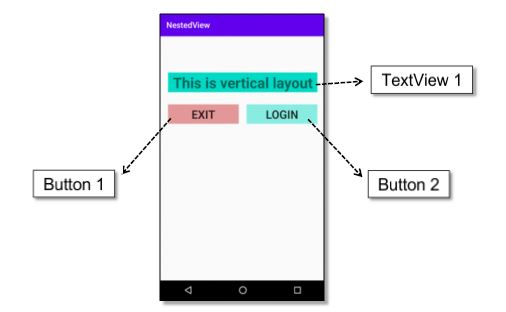

1. Buka tab activity_main.xml.

2. Buat vertikal LinearLayout dengan id “nestedViewActivity” sebagai layout utama, lalu tambahkan atributnya.

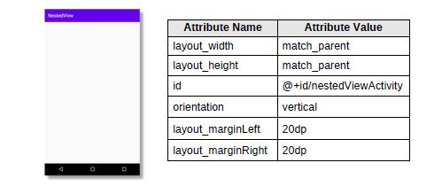

*Screenshot Source Code*

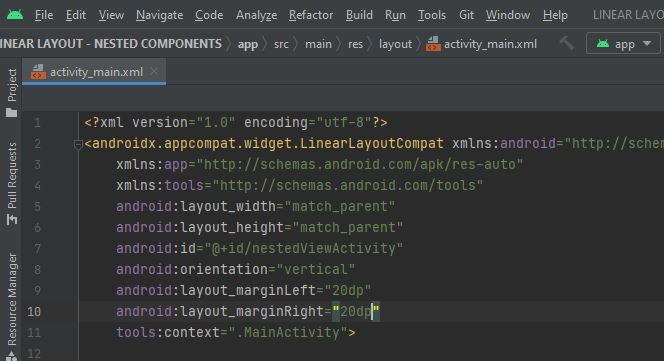

3. Didalam tag Linear Layout utama, tambahkan TextView dengan id “textView1”. lalu tambahkan atributnya.

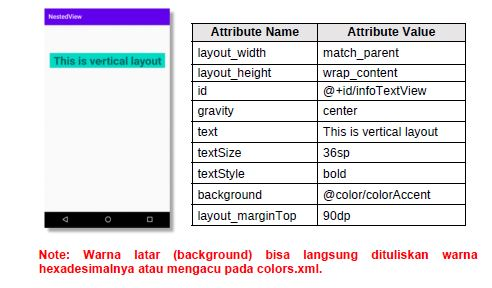

*Screenshot Source Code*

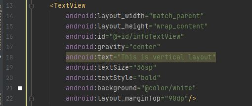

4. Tambahkan komponent Horizontal LinearLayout dengan id “nestedView”, di dalam tag Linear Layout utama.

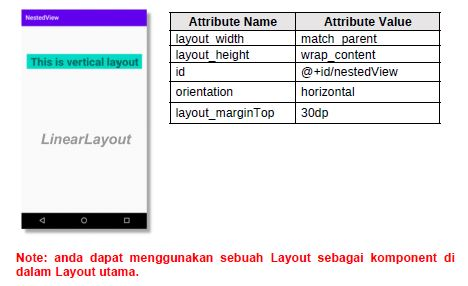

*Screenshot Source Code*

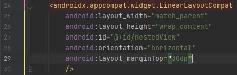

5. Tambahkan sebuah Button exit dengan id “exitButton” di dalam tag horizontal LinearLayout. lalu tambahkan atributnya.

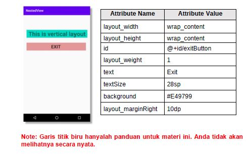

*Screenshot Source Code*

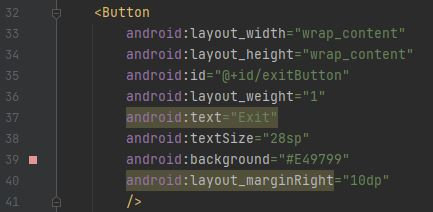

6. Tambahkan sebuah Button login dengan id “loginButton” di dalam tag horizontal LinearLayout.

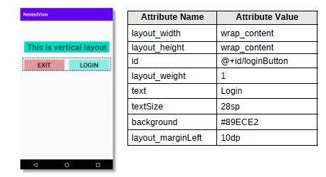

*Screenshot Source Code*

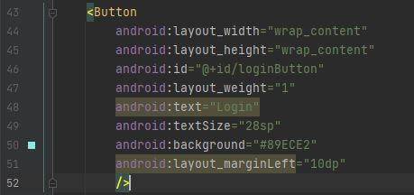

7. Lakukan Submit !

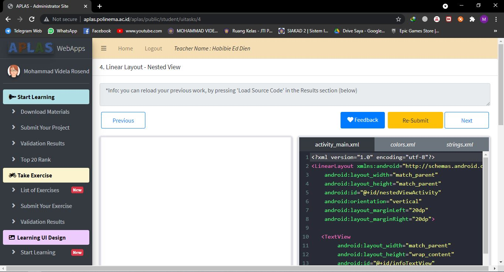

8. Dapatkan hasil dari pengerjaan. Jika berhasil, anda akan mendapat status PASSED. Jika gagal, anda akan mendapat status ERROR atau FAILED. Lihat dan cek validation detail dan teruslah mencoba

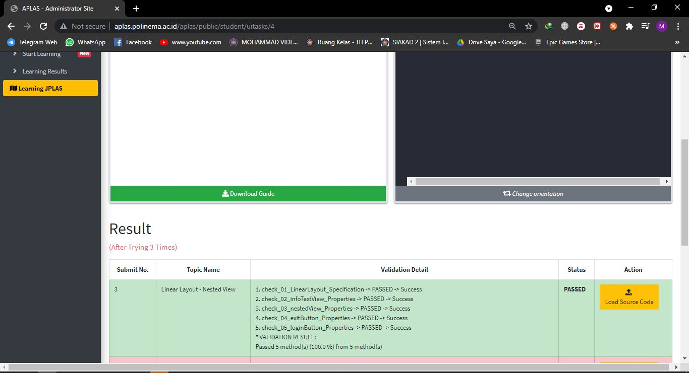

*Screenshot Hasil Running di HP*

[Kode Program ActivityMain Tugas 4](https://github.com/VidelRosendyDirgantara/Mobile-3I-21/blob/02a90dd03e113516c5fff566d89051567364dc2a/src/01_Layout/01_Tugas4_LINEAR%20LAYOUT%20-%20NESTED%20COMPONENTS/app/src/main/res/layout/activity_main.xml)