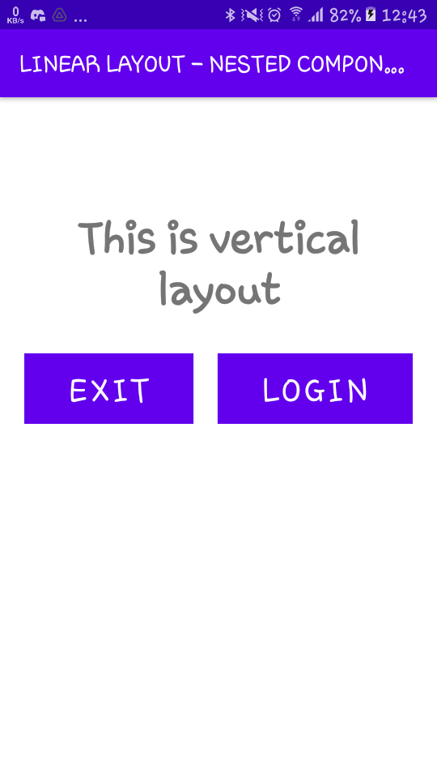

# 01 - Tugas 4 - NESTED COMPONENTS

## Tujuan Pembelajaran

1. Mahasisiwa mampu membuat komponen bersarang, horizontal linear layout pada vertikal linear layout. 

## Hasil Praktikum

1. Buka tab activity_main.xml.

2. Buat vertikal LinearLayout dengan id “nestedViewActivity” sebagai layout utama, lalu tambahkan atributnya.

*Screenshot Source Code*

3. Didalam tag Linear Layout utama, tambahkan TextView dengan id “textView1”. lalu tambahkan atributnya.

*Screenshot Source Code*

4. Tambahkan komponent Horizontal LinearLayout dengan id “nestedView”, di dalam tag Linear Layout utama.

*Screenshot Source Code*

5. Tambahkan sebuah Button exit dengan id “exitButton” di dalam tag horizontal LinearLayout. lalu tambahkan atributnya.

*Screenshot Source Code*

6. Tambahkan sebuah Button login dengan id “loginButton” di dalam tag horizontal LinearLayout.

*Screenshot Source Code*

7. Lakukan Submit !

8. Dapatkan hasil dari pengerjaan. Jika berhasil, anda akan mendapat status PASSED. Jika gagal, anda akan mendapat status ERROR atau FAILED. Lihat dan cek validation detail dan teruslah mencoba

*Screenshot Hasil Running di HP*

