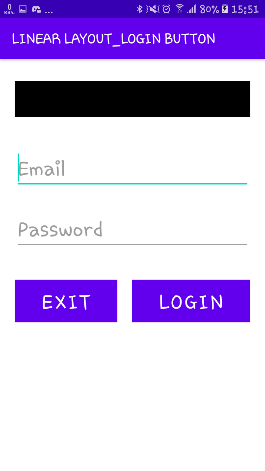

# 01 - Tugas 5 - LOGIN PAGE

## Tujuan Pembelajaran

1. Siswa akan membuat halaman login sederhana berdasarkan materi yang telah dipelajari sebelumnya. Dalam topik terakhir tentang linear layout ini, akan terlihat jelas apa yang telah kita pelajari. 

## Hasil Praktikum

1. Buka tab activity_main.xml.

2. Buat sebuah vertikal LinearLayout dengan id “loginActivity” sebagai layout utama. lalu tabahkan atributnya.

*Screenshot Source Code*

3. Di dalam tag Linear Layout utama, Buat sebuah TextView untuk menampilkan teks “Login Page” dengan id “loginTextView”. Atur lebarnya sama seperti lebar layout induk (layout utama). lalu tabahkan atributnya.

*Screenshot Source Code*

4. Tambahkan email EditText dengan id “emailEditText”, di dalam tag Linear Layout utama untuk menerima input dari pengguna.

*Screenshot Source Code*

5. Tambahkan password EditText dengan id “passwordEditText”, disamping email EditText untuk menerima masukkan dari pengguna. Atur jenis masukan hanya untuk menerima kata sandi.

*Screenshot Source Code*

6. Buat nested component/views untuk meletakkan tombol secara horizontal dari LinearLayout dengan id “nestedView”, di dalam tag linear layout utama setelah password EditText.

*Screenshot Source Code*

7. Tambah exit Button dengan id “exitButton”, di dalam nestedView LinearLayouts.

*Screenshot Source Code*

8. Tambhakan login Button dengan id “loginButton”, di dalam nestedView LinearLayouts.

*Screenshot Source Code*

9. Lakukan Submit !

10. Dapatkan hasil dari pengerjaan. Jika berhasil, anda akan mendapat status PASSED. Jika gagal, anda akan mendapat status ERROR atau FAILED. Lihat dan cek validation detail dan teruslah mencoba

*Screenshot Hasil Running di HP*

