# 01 - Tugas 5 - LOGIN PAGE

## Tujuan Pembelajaran

1. Siswa akan membuat halaman login sederhana berdasarkan materi yang telah dipelajari sebelumnya. Dalam topik terakhir tentang linear layout ini, akan terlihat jelas apa yang telah kita pelajari. 

## Hasil Praktikum

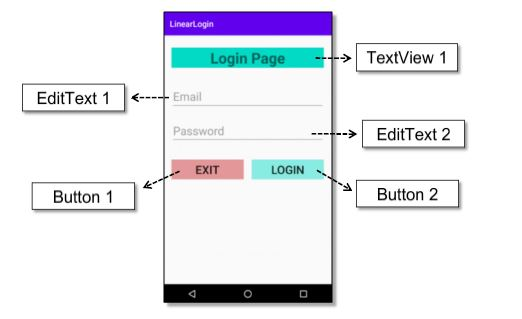

1. Buka tab activity_main.xml.

2. Buat sebuah vertikal LinearLayout dengan id “loginActivity” sebagai layout utama. lalu tabahkan atributnya.

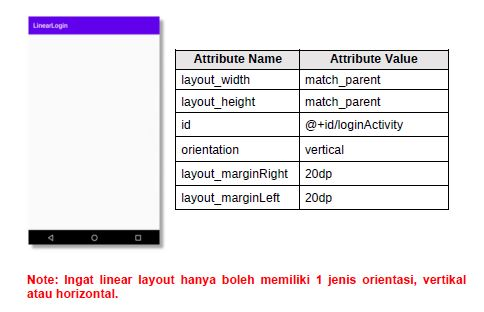

*Screenshot Source Code*

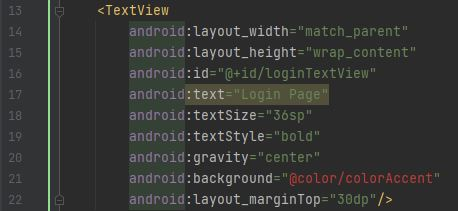

3. Di dalam tag Linear Layout utama, Buat sebuah TextView untuk menampilkan teks “Login Page” dengan id “loginTextView”. Atur lebarnya sama seperti lebar layout induk (layout utama). lalu tabahkan atributnya.

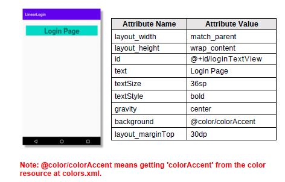

*Screenshot Source Code*

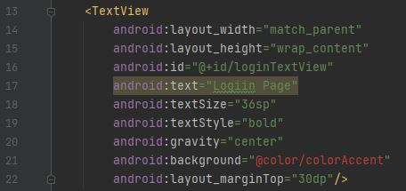

4. Tambahkan email EditText dengan id “emailEditText”, di dalam tag Linear Layout utama untuk menerima input dari pengguna.

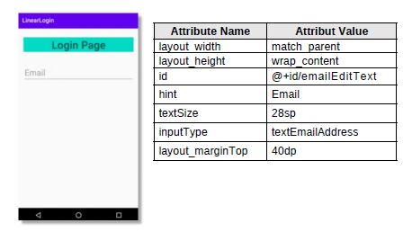

*Screenshot Source Code*

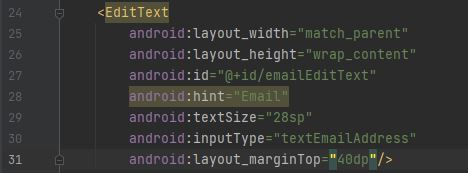

5. Tambahkan password EditText dengan id “passwordEditText”, disamping email EditText untuk menerima masukkan dari pengguna. Atur jenis masukan hanya untuk menerima kata sandi.

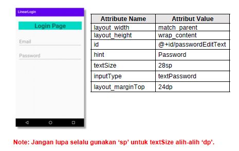

*Screenshot Source Code*

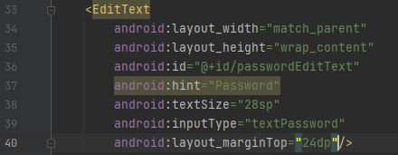

6. Buat nested component/views untuk meletakkan tombol secara horizontal dari LinearLayout dengan id “nestedView”, di dalam tag linear layout utama setelah password EditText.

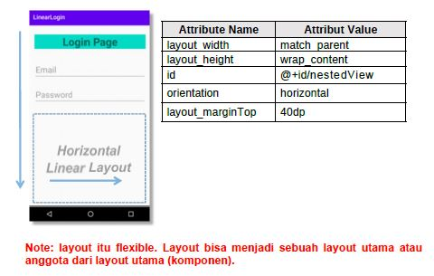

*Screenshot Source Code*

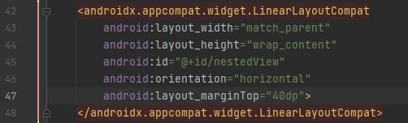

7. Tambah exit Button dengan id “exitButton”, di dalam nestedView LinearLayouts.

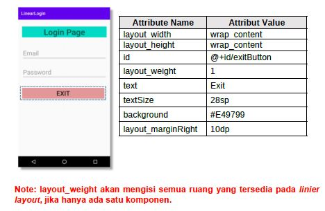

*Screenshot Source Code*

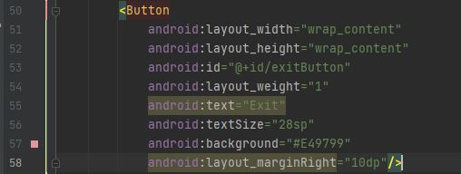

8. Tambhakan login Button dengan id “loginButton”, di dalam nestedView LinearLayouts.

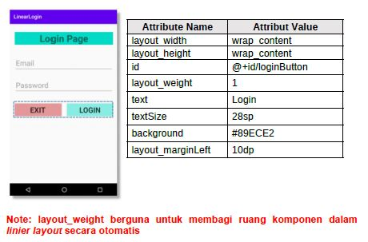

*Screenshot Source Code*

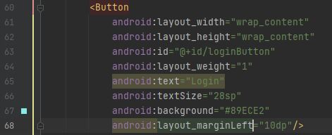

9. Lakukan Submit !

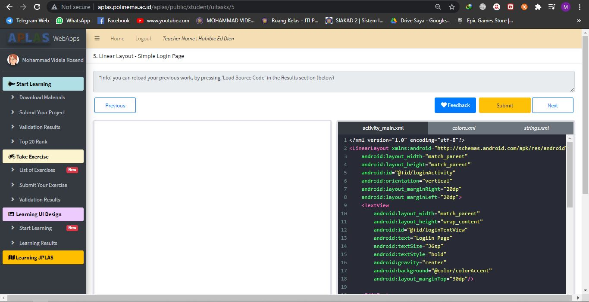

10. Dapatkan hasil dari pengerjaan. Jika berhasil, anda akan mendapat status PASSED. Jika gagal, anda akan mendapat status ERROR atau FAILED. Lihat dan cek validation detail dan teruslah mencoba

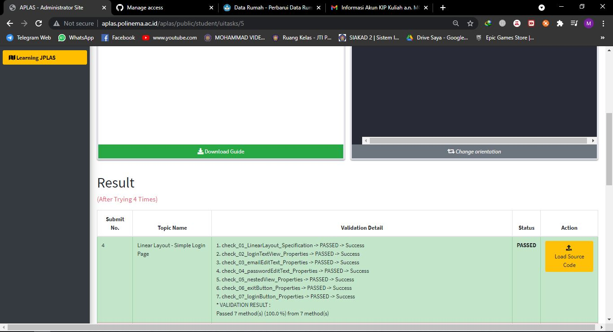

*Screenshot Hasil Running di HP*

[Kode Program ActivityMain Tugas 5](https://github.com/VidelRosendyDirgantara/Mobile-3I-21/blob/aff1a090ddbcecdb94d204aa7ddce4117f73bb47/src/01_Layout/01_Tugas5_LINEAR%20LAYOUT%20-%20LOGIN%20PAGE/app/src/main/res/layout/activity_main.xml)