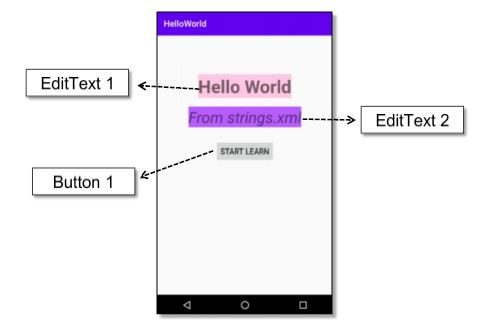

# 01 - Tugas 6 - RELATIVE LAYOUT - LOGIN PAGE

## Tujuan Pembelajaran

1. Mahasiswa mengetahui bagaimana cara menggunakan sumber daya string untuk teks sebuah komponen. 

## Hasil Praktikum

1. Buka tab strings.xml.

2. Tambahkan sumber daya string seperti yang dijelaskan di bawah.

Template: <string name="string-name">string-value</string>

*Screenshot Source Code*

3. Buka tab activity_main.xml.

4. Buat sebuah RelativeLayout dengan id “stringActivity” sebagai layout utama, lalu tambahkan atributnya

*Screenshot Source Code*

5. Di dalam tag Relative Layout utama, buat sebuah TextView dengan id “helloWorldTextView”. Jangan ragu untuk mewarnai tampilan sesuka Anda. lalu tambahkan atributnya.

*Screenshot Source Code*

6. Tambahkan satu lagi Textview dengan id “secondTextView” di bawah “helloWorldTextView” Textview. Jangan ragu untuk mewarnai tampilan sesuka Anda. lalu tambahkan atributnya .

*Screenshot Source Code*

7. Tambahkan Button dengan id “learnButton” di bawah “secondTextView” Textview.

*Screenshot Source Code*

8. Lakukan Submit !

9. Dapatkan hasil dari pengerjaan. Jika berhasil, anda akan mendapat status PASSED. Jika gagal, anda akan mendapat status ERROR atau FAILED. Lihat dan cek validation detail dan teruslah mencoba

*Screenshot Hasil Running di HP*

[Kode Program ActivityMain Tugas 6](https://github.com/VidelRosendyDirgantara/Mobile-3I-21/blob/91a467a4f8977b05aa111de746da5c562c467984/src/01_Layout/01_Tugas6_RELATIVELAYOUT%20-%20STRINGSXML/app/src/main/res/layout/activity_main.xml)

[Kode Program Strings Tugas 6](https://github.com/VidelRosendyDirgantara/Mobile-3I-21/blob/91a467a4f8977b05aa111de746da5c562c467984/src/01_Layout/01_Tugas6_RELATIVELAYOUT%20-%20STRINGSXML/app/src/main/res/values/strings.xml)