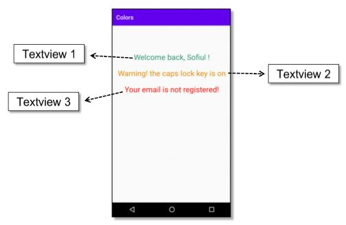

# 01 - Tugas 7 - RELATIVE LAYOUT - COLORS.XML

## Tujuan Pembelajaran

1. Mahasiswa mengetahui cara menggunakan sumber daya string dan warna untuk textview. 

## Hasil Praktikum

1. Buka tab strings.xml.

2. Tambahkan sumber daya string seperti yang dijelaskan di bawah.

Template: <string name="string-name">string-value</string>

*Screenshot Source Code*

3. Buka tab colors.xml

4. Tambahkan sumber daya warna seperti yang dijelaskan di bawah.

Template: <color name="color-name">color-value</color>

*Screenshot Source Code*

5. Open tab activity_main.xml.

6. Buat sebuah RelativeLayout dengan id “colorsActivity” sebagai layout utama, lalu tambahkan atributnya.

*Screenshot Source Code*

7. Di dalam tag Relative Layout utama, buat sebuah TextView dengan id “successTextView”. TextView ini untuk memberi sambutan saat user berhasil masuk. Gunakan successMessage pada strings.xml. Ubah warna teks menjadi warna green tea mengacu pada colors.xml.

*Screenshot Source Code*

8. Tambahkan TextView dengan id “warningTextView”. TextView ini untuk memberi peringatan kepada pengguna ketika tombol caps lock menyala. Gunakan warningMessage pada strings.xml. Ubah warna text menjadi warna yellow mayo mengacu pada colors.xml.

*Screenshot Source Code*

9. Tambahkan TextView dengan id “alertTextView”. TextView ini berguna untuk memperingatkan pengguna ketika email tidak terdaftar. Gunakan alertMessage pada strings.xml. Ubah warna teks menjadi red chilli color mengacu pada colors.xml.

*Screenshot Source Code*

10. Lakukan Submit !

11. Dapatkan hasil dari pengerjaan. Jika berhasil, anda akan mendapat status PASSED. Jika gagal, anda akan mendapat status ERROR atau FAILED. Lihat dan cek validation detail dan teruslah mencoba

*Screenshot Hasil Running di HP*

[Kode Program ActivityMain Tugas 6](https://github.com/VidelRosendyDirgantara/Mobile-3I-21/blob/e3e5104f2df3614bdc0e5bf7b7a64035f66e4ed7/src/01_Layout/01_Tugas7_RELATIVE%20LAYOUT%20-%20COLORS.XML/app/src/main/res/layout/activity_main.xml)

[Kode Program Strings Tugas 6](https://github.com/VidelRosendyDirgantara/Mobile-3I-21/blob/e3e5104f2df3614bdc0e5bf7b7a64035f66e4ed7/src/01_Layout/01_Tugas7_RELATIVE%20LAYOUT%20-%20COLORS.XML/app/src/main/res/values/strings.xml)

[Kode Program Color Tugas 6]https://github.com/VidelRosendyDirgantara/Mobile-3I-21/blob/e3e5104f2df3614bdc0e5bf7b7a64035f66e4ed7/src/01_Layout/01_Tugas7_RELATIVE%20LAYOUT%20-%20COLORS.XML/app/src/main/res/values/colors.xml)