# 01 - Tugas 8 - RELATIVE LAYOUT - IMAGEVIEW

## Tujuan Pembelajaran

1. Mahasiswa mengetahui cara menampilkan gambar menggunakan imageview.

## Hasil Praktikum

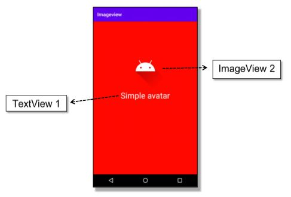

1. Buka tab strings.xml.

2. Tambahkan sumber daya string seperti yang dijelaskan di bawah.

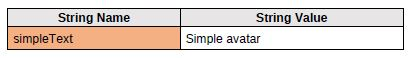

*Screenshot Source Code*

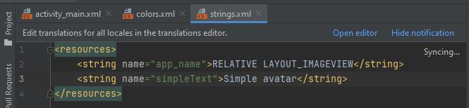

3. Buka tab colors.xml.

4. Tambahkan sumber daya warna seperti yang dijelaskan di bawah

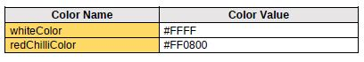

*Screenshot Source Code*

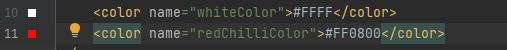

5. Buka tab activity_main.xml.

6. Buatlah sebuah RelativeLayout dengan id “imageActivity” sebagai layout utama. Atur warna background menjadi warna red chilli mengacu pada colors.xml. Lalu tambahkan atributnya

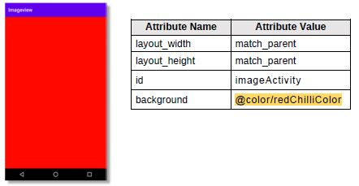

*Screenshot Source Code*

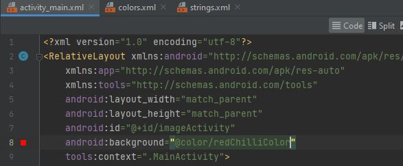

7. Di dalam tag Relative Layout utama, buat sebuah ImageView dengan id “avatarImageView”. ImageView ini untuk menampilkan gambar sederhana dari sumber drawable bawaan. Lalu tambahkan atributnya.

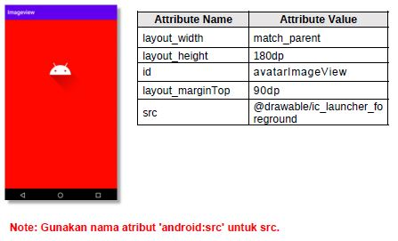

*Screenshot Source Code*

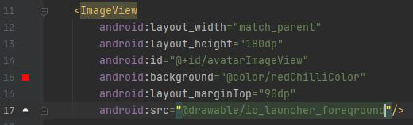

8. Tambahkan TextView dengan id “simpleTextView”. TextView ini untuk menampilkan teks sederhana dibawah ImageView. Gunakan simpleText mengacu pada strings.xml. Ubah warna teks menjadi white color mengacu pada colors.xml.

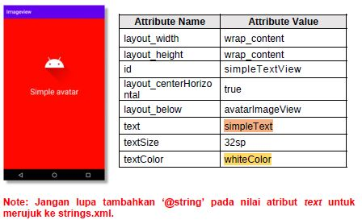

*Screenshot Source Code*

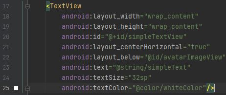

9. Lakukan Submit !

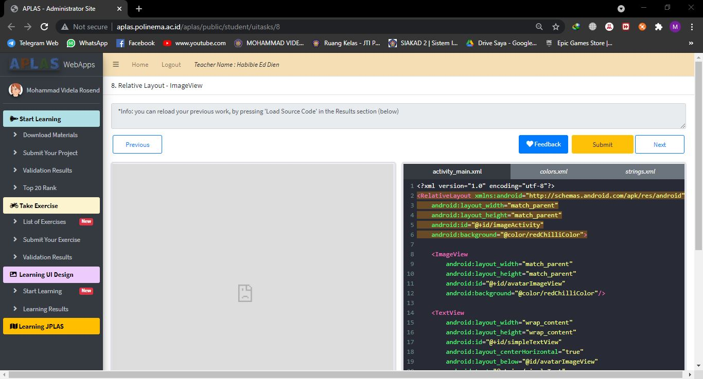

10. Dapatkan hasil dari pengerjaan. Jika berhasil, anda akan mendapat status PASSED. Jika gagal, anda akan mendapat status ERROR atau FAILED. Lihat dan cek validation detail dan teruslah mencoba

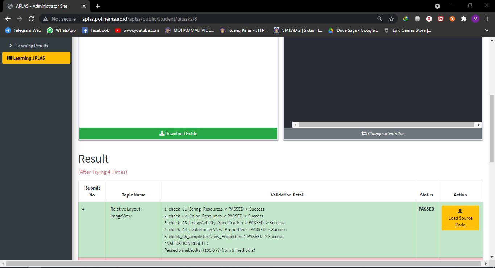

*Screenshot Hasil Running di HP*

Saat di run di HP saya auto force close tetapi di aplas telah benar

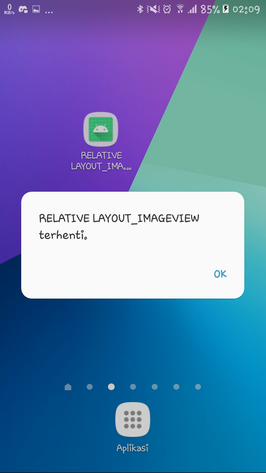

[Kode Program ActivityMain Tugas 8](https://github.com/VidelRosendyDirgantara/Mobile-3I-21/blob/4fe4a9b85704333ae3fe7e939edc61fe3be433a1/src/01_Layout/01_Tugas8_RELATIVE%20LAYOUT%20-%20IMAGEVIEW/app/src/main/res/layout/activity_main.xml)

[Kode Program Strings Tugas 8](https://github.com/VidelRosendyDirgantara/Mobile-3I-21/blob/4fe4a9b85704333ae3fe7e939edc61fe3be433a1/src/01_Layout/01_Tugas8_RELATIVE%20LAYOUT%20-%20IMAGEVIEW/app/src/main/res/values/strings.xml)

[Kode Program Color Tugas 8](https://github.com/VidelRosendyDirgantara/Mobile-3I-21/blob/4fe4a9b85704333ae3fe7e939edc61fe3be433a1/src/01_Layout/01_Tugas8_RELATIVE%20LAYOUT%20-%20IMAGEVIEW/app/src/main/res/values/colors.xml)