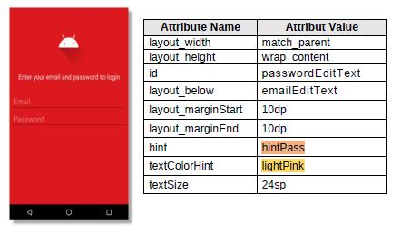

# 01 - Tugas 9 - RELATIVE LAYOUT - MODERN LOGIN UI

## Tujuan Pembelajaran

1. Mahasiswa mengetahui cara membuat sebuah tampilan antarmuka login yang modern dengan relative layout.

## Hasil Praktikum

1. Buka tab strings.xml.

2. Tambahkan sumber daya string seperti yang dijelaskan di bawah.

Template: <string name="string-name">string-value</string>

*Screenshot Source Code*

3. Buka tab colors.xml.

4. Tambahkan sumber daya warna seperti yang dijelaskan di bawah.
Template: <color name="color-name">color-value</color>

*Screenshot Source Code*

5. Buka tab activity_main.xml.

6. Buat sebuah RelativeLayout dengan id “modernloginActivity” sebagai layout utama, lalu tambahkan atributnya. Gunakan sumber daya warna yang telah kita buat sebelumnya untuk warna background.

*Screenshot Source Code*

7. Di dalam tag Relative Layout utama, buat sebuah ImageView dengan id “avatarImageView”. ImageView ini berguna untuk menampilkan gambar avatar bawaan.

*Screenshot Source Code*

8. Tambah TextView dengan id “userInfoTextView” di bawah “avatarImageView”. TextView ini berguna sebagai instruksi bagi pengguna. Gunakan sumber daya string dan warna yang telah kita buat sebelumnya untuk text dan textColor.

*Screenshot Source Code*

9. Tambahkan EditText dengan id “emailEditText” di bawah “userInfoTextView”. EditText ini untuk menerima email dari pengguna. Beri teks petunjuk untuk memudahkan pengguna. Gunakan sumber daya string dan warna yang telah kita buat sebelumnya untuk hint and textColorHint.

*Screenshot Source Code*

10. Tambahkan EditText dengan id “passwordEditText” di bawa “emailEditText”. EditText ini untuk menerima password dari pengguna. Beri teks petunjuk untuk memudahkan pengguna. Gunakan sumber daya string dan warna yang telah kita buat sebelumnya untuk hint and textColorHint.

*Screenshot Source Code*

11. Tambahkan Button login dengan id “loginButton” di bawah “passwordEditText”. Button ini untuk melakukan tindakan login. Gunakan sumber daya string dan warna yang telah kita buat sebelumnya untuk text dan background.

*Screenshot Source Code*

12. Tambahkan TextView dengan id “questionTextView” di bawah “loginButton”. TextView ini berguna untuk menawarkan pendaftaran untuk pengguna baru. Gunakan sumber daya string dan warna yang telah kita buat sebelumnya untuk text dan textColor.

*Screenshot Source Code*

13. Tambahkan TextView dengan id “registerTextView” di bawah “questionTextView”. TextView ini berguna untuk mengarahkan pengguna ke halaman pendaftaran saat diklik. Tapi itu tidak akan terjadi sekarang karena kita membutuhkan backend untuk melakukan tugas itu. Gunakan sumber daya string dan warna yang telah kita buat sebelumnya untuk text and textColor.

*Screenshot Source Code*

14. Lakukan Submit !

15. Dapatkan hasil dari pengerjaan. Jika berhasil, anda akan mendapat status PASSED. Jika gagal, anda akan mendapat status ERROR atau FAILED. Lihat dan cek validation detail dan teruslah mencoba

*Screenshot Hasil Running di HP*

[Kode Program ActivityMain Tugas 8](https://github.com/VidelRosendyDirgantara/Mobile-3I-21/blob/master/src/01_Layout/01_Tugas9_RELATIVE%20LAYOUT%20-%20MODERN%20LOGIN%20UI/app/src/main/res/layout/activity_main.xml)

[Kode Program Strings Tugas 8](https://github.com/VidelRosendyDirgantara/Mobile-3I-21/blob/master/src/01_Layout/01_Tugas9_RELATIVE%20LAYOUT%20-%20MODERN%20LOGIN%20UI/app/src/main/res/values/strings.xml)

[Kode Program Color Tugas 8](https://github.com/VidelRosendyDirgantara/Mobile-3I-21/blob/master/src/01_Layout/01_Tugas9_RELATIVE%20LAYOUT%20-%20MODERN%20LOGIN%20UI/app/src/main/res/values/colors.xml)