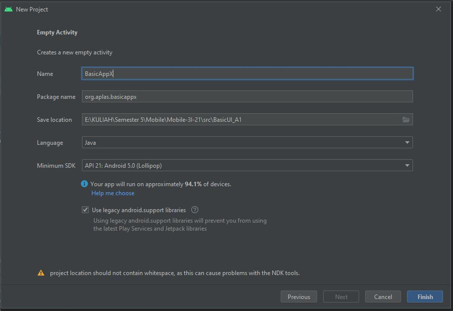

# A1 - Basic UI Java Edition (01)

## Tujuan Pembelajaran

1. Mahasiswa mampu memulai Android Studio Project dengan layout kosong.

## Hasil Praktikum

1. Buatlah proyek Android Studio baru.

2. Lanjutkan membuat proyek berdasarkan spesifikasi berikut ini. dialog “Choose Your Project”. pastikan Project yang anda buat sesuai degan spesifikasi di bawah :

3. Ubah konten file “build.graddle (Module: app)” seperti berikut ini Lanjutkan pengaturan proyek Anda dengan spesifikasi berikut ini. Setelah anda mengubah kode kemudian pada pojok kanan atas akan menunjukkan kata “sync-now”, klik untuk melakukan singkronisasi graddle

4. Hapus “ExampleUnitTest” di folder “org.aplas.basicapp (test)”.

5. Salin file “TestA1BasicUI011X.java” dan “ViewTest.java” ke folder “org.aplas.basicappx (test)”

6. Klik kanan pada file “TestA1BasicUIX011.java” kemudian pilih dan klik Run ‘TestA1BasicUIX011’. Hal ini akan memerlukan waktu dalam pelaksanaannya.

7. Periksa hasil dari tugas Anda. Anda dinyatakan berhasil jika mendapatkan tanda centang hijau. Jika gagal, Anda akan mendapatkan tanda silang oranye dan beberapa pesan, dan harus mengulang proyek Anda.

# A1 - Basic UI Java Edition (02)