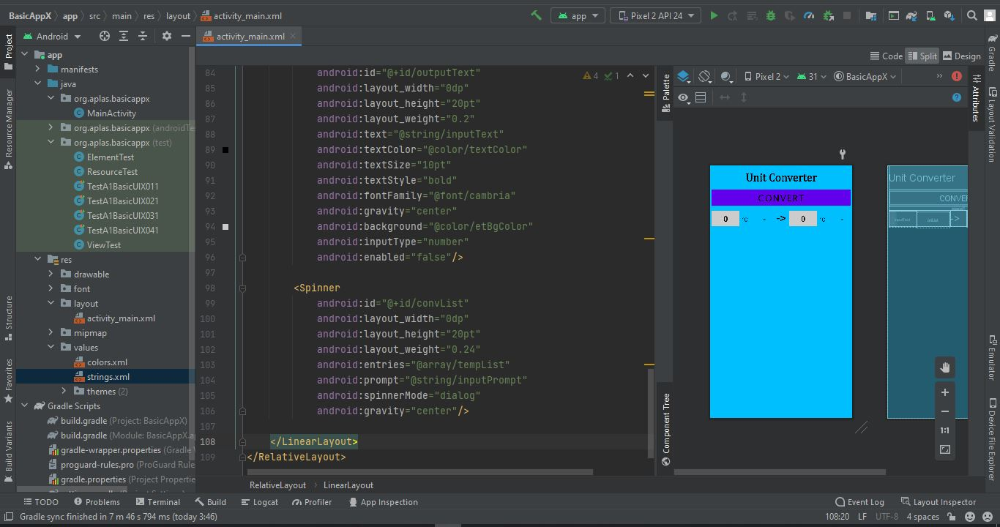

# A1 - Basic UI Java Edition (01)

## Tujuan Pembelajaran

1. Mahasiswa mampu memulai Android Studio Project dengan layout kosong.

## Hasil Praktikum

1. Buatlah proyek Android Studio baru.

2. Lanjutkan membuat proyek berdasarkan spesifikasi berikut ini. dialog “Choose Your Project”. pastikan Project yang anda buat sesuai degan spesifikasi di bawah :

3. Ubah konten file “build.graddle (Module: app)” seperti berikut ini Lanjutkan pengaturan proyek Anda dengan spesifikasi berikut ini. Setelah anda mengubah kode kemudian pada pojok kanan atas akan menunjukkan kata “sync-now”, klik untuk melakukan singkronisasi graddle

4. Hapus “ExampleUnitTest” di folder “org.aplas.basicapp (test)”.

5. Salin file “TestA1BasicUI011X.java” dan “ViewTest.java” ke folder “org.aplas.basicappx (test)”

6. Klik kanan pada file “TestA1BasicUIX011.java” kemudian pilih dan klik Run ‘TestA1BasicUIX011’. Hal ini akan memerlukan waktu dalam pelaksanaannya.

7. Periksa hasil dari tugas Anda. Anda dinyatakan berhasil jika mendapatkan tanda centang hijau. Jika gagal, Anda akan mendapatkan tanda silang oranye dan beberapa pesan, dan harus mengulang proyek Anda.

# A1 - Basic UI Java Edition (02)

## Tujuan Pembelajaran

1. Mahasiswa memahami cara mengkonfigurasi Android Studio Project Resource, seperti string dan font.

## Hasil Praktikum

1. Buka proyek BasicAppX yang telah lulus pengujian.

2. Buat folder “font” di bawah folder “res”. Klik kanan folder “res” dan pilih “New – Adroid Resource Directory”.

Kemudian tampilkan “New Resource Directory”, dan pilih Resource type: “font”,

kemudian klik “OK”.

3. Salin file “cambria.ttf” dan “lucida.ttf” dalam folder Supplement ke dalam folder “font” yang sudah dibuat.

4. Buka file “strings.xml” di bawah folder “res/values”

5. Edit nilai seluruh “string” name seperti di bawah ini.

Template: <string name=”string-name”>string-value</string>

6. Buka file “colors.xml” di bawah folder “res/values” kemudian edit nilai seluruh “color” name seperti di bawah ini.

Template: <color name=”color-name”>color-value</string>

7. Salin file “TestA1BasicUIX021.java” dan “ResourceTest.java” ke dalam folder “org.aplas.basicappx (test)”

8. Klik kanan file “TestA1BasicUIX021.java” kemudian pilih dan klik Run ‘TestA1BasicUIX021’. Hal ini membutuhkan waktu dalam pelaksanaannya.

9. Periksa hasil dari tugas Anda. Anda dinyatakan berhasil jika mendapatkan tanda centang hijau. Jika gagal, Anda akan mendapatkan tanda silang oranye dan beberapa pesan, dan harus mengulang proyek Anda.

# A1 - Basic UI Java Edition (03)

## Tujuan Pembelajaran

1. Mahasiswa mampu merancang layout dasar, menambahkan TextView, dan sebuah Button.

## Hasil Praktikum

1. Buka proyek BasicAppX yang telah lulus pengujian.

2. Buka file “activity_main.xml” dalam layout resource, untuk memulai rancangan UI.

3. Pada layout editor xml, hapus default “ConstraintLayout” beserta seluruh tag-nya dan buatlah sebuah “RelativeLayout” dengan id “mainLayout” sebagai layout utamanya sesuai dengan spesifikasi di bawah ini.

4. Pada tag RelativeLayout, tambahkan TextView dengan id “myTextView1” sesuai dengan spesifikasi di bawah ini.

5. Di bawah TextView, tambahkan sebuah Button dengan id “convertButton” sesuai dengan spesifikasi di bawah ini.

6. UI akan menjadi seperti gambar di bawah ini.

7. Salin file “TestA1BasicUIX031.java” dan “ElementTest.java” ke dalam folder “org.aplas.basicappx (test)”

8. Klik kanan file “TestA1BasicUIX031.java” kemudian pilih dan klik Run ‘TestA1BasicUIX031’. Hal ini membutuhkan waktu dalam pelaksanaannya.

9. Periksa hasil dari tugas Anda. Anda dinyatakan berhasil jika mendapatkan tanda centang hijau. Jika gagal, Anda akan mendapatkan tanda silang oranye dan beberapa pesan, dan harus mengulang proyek Anda.

# A1 - Basic UI Java Edition (04)

## Tujuan Pembelajaran

1. Mahasiswa mampu membuat Space dan menambahkan Child Layout.

## Hasil Praktikum

1. Buka proyek BasicAppX yang telah lulus pengujian.

2. Buka file activity_main.xml, untuk mulai merancang UI.

3. Pada layout xml editor, buat sebuah “Space” dengan id “space” sesuai spesifikasi berikut.

4. Di bawah Space, tambahkan LinearLayout sebagai Child Layout dengan id “child1” sesuai spesifikasi berikut.

5. UI akan tampak seperti gambar berikut ini.

6. Salin file “TestA1BasicUIX041.java” ke dalam folder “org.aplas.basicapp (test)”

7. Klik kanan file “TestA1BasicUIX041.java” kemudian pilih dan klik Run ‘TestA1BasicUIX041’. Hal ini memerlukan waktu dalam pelaksanaannya.

8. Periksa hasil dari tugas Anda. Anda dinyatakan berhasil jika mendapatkan tanda centang hijau. Jika gagal, Anda akan mendapatkan tanda silang oranye dan beberapa pesan, dan harus mengulang proyek Anda.

# A1 - Basic UI Java Edition (05)

## Tujuan Pembelajaran

1. Mahasiswa mengetahui cara mengkonfigurasi color resources, membuat EditText, dan Spinner.

## Hasil Praktikum

1. Buka proyek BasicAppX yang telah lulus pengujian.

2. Buka file “strings.xml” di bawah folder “res/values”.

3. Tambahkan nilai pada seluruh “string-array” name seperti di bawah ini. Template:

<string-array name=”string-name”>
<item>value1</item>

4. Buka file activity_layout.xml, untuk mulai merancang UI.

5. Pada LinearLayout dengan tag “child1”, tambahkan EditText dengan id “inputText” seperti berikut ini.

6. Di bawah EditText, tambahkan sebuah Spinner dengan id “oriList” sesuai spesifikasi dokumen.

7. Di bawah Spinner, tambahkan TextView dengan id “myTextView2” sesuai spesifikasi dokumen.

8. Di bawah TextView, tambahkan EditText dengan id “outputText” sesuai spesifikasi dokumen.

9. Di bawah EditText, tambahkan Spinner dengan id “convList” sesuai spesifikasi dokumen.

10. Hasilnya akan tampak seperti gambar di bawah ini.

11. Salin file “TestA1BasicUIX051.java” dan “TestA1BasicUIX052.java” ke folder “org.aplas.basicapp (test)”.

12. Klik kanan file “TestA1BasicUIX051.java” kemudian pilik dan klik Run ‘TestA1BasicUIX051’. Hal ini akan membutuhkan waktu dalam pelaksanaannya. Lakukan Langkah yang sama pada file “TestA1BasicUIX052.java”.

13. Periksa hasil dari tugas Anda. Anda dinyatakan berhasil jika mendapatkan tanda centang hijau. Jika gagal, Anda akan mendapatkan tanda silang oranye dan beberapa pesan, dan harus mengulang proyek Anda.

# A1 - Basic UI Java Edition (06)

## Tujuan Pembelajaran

1. Mahasiswa mampu membuat CheckBox.

## Hasil Praktikum

1. Buka proyek BasicAppX yang telah lulus pengujian.

2. Buka file activity_main.xml, untuk mulai merancang UI.

3. Di bawah LinearLayout “child1”, buat LinearLayout dengan id “child2” sesuai spesifikasi berikut.

4. Pada tag “child2”, tambahkan CheckBox dengan id “chkRounded” sesuai spesifikasi berikut.

5. Di bawah checkbox “chkRounded”, tambahkan CheckBox dengan id “chkFormula” sesuai spesifikasi berikut.

6. Hasilnya akan tampak seperti gambar di bawah ini.

7. Salin file “TestA1BasicUIX061.java” ke folder “org.aplas.basicapp (test)”

8. Klik kanan file “TestA1BasicUIX061.java” kemudian pilih dan klik Run ‘TestA1BasicUIX061’. Hal ini akan membutuhkan waktu dalam pelaksanaannya.

9. Periksa hasil dari tugas Anda. Anda dinyatakan berhasil jika mendapatkan tanda centang hijau. Jika gagal, Anda akan mendapatkan tanda silang oranye dan beberapa pesan, dan harus mengulang proyek Anda

# A1 - Basic UI Java Edition (07)

## Tujuan Pembelajaran

1. Mahasiswa mampu membuat RadioGroup dan RadioButton.

## Hasil Praktikum

1. Buka proyek BasicAppX yang telah lulus pengujian.

2. Buka file activity_main.xml, untuk memulai mendesain UI.

3. Di bawah LinearLayout “child2”, buatlah RadioGroup dengan id “radioGroup” sesuai spesifikasi berikut

4. Dalam tag “radioGroup”, tambahkan 3 RadioButton(s) dengan id “rbTemp”, “rbDist”, dan “rbWeight” sesuai spesifikasi berikut.

5. Hasilnya akan tampak seperti gambar berikut.

6. Salin file “TestA1BasicUIX071.java” ke dalam folder “org.aplas.basicappx (test)”.

7. Klik kanan file “TestA1BasicUIX071.java” kemudian pilih dan klik Run ‘TestA1BasicUIX071’. Hal ini akan membutuhkan waktu dalam pelaksanaannya.

8. Periksa hasil dari tugas Anda. Anda dinyatakan berhasil jika mendapatkan tanda centang hijau. Jika gagal, Anda akan mendapatkan tanda silang oranye dan beberapa pesan, dan harus mengulang proyek Anda.

