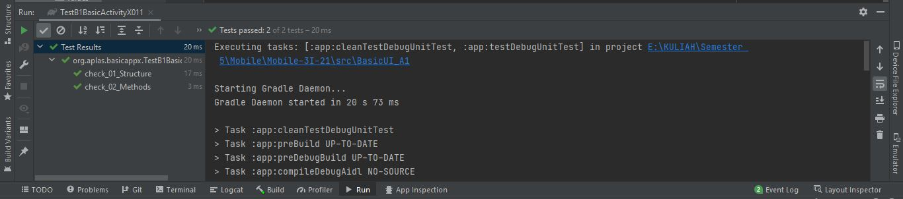
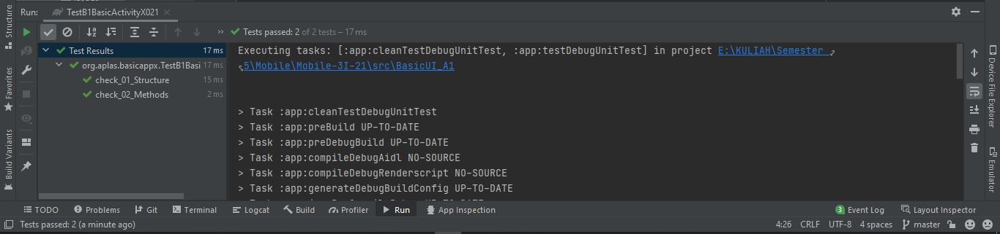
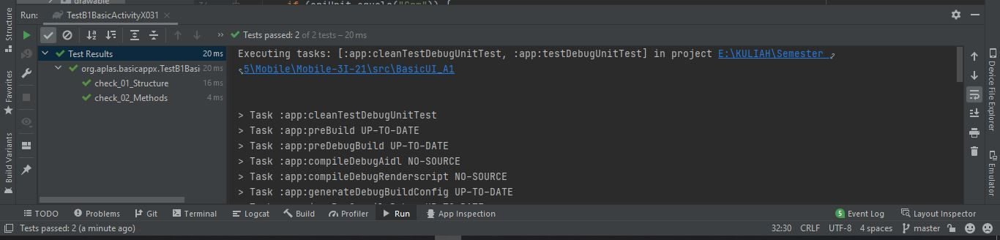
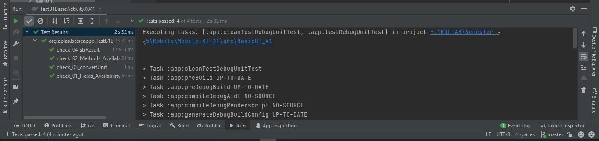
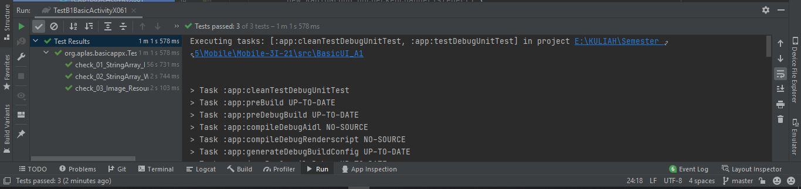
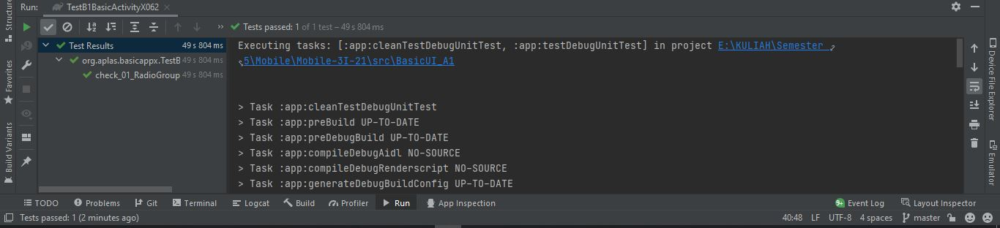
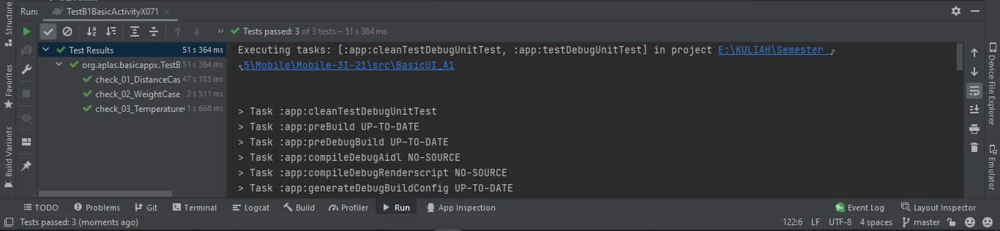
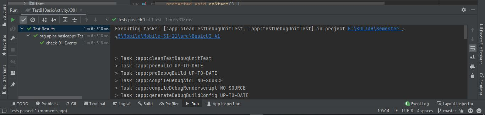
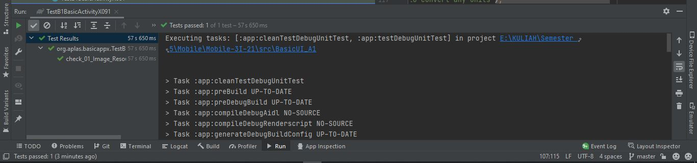
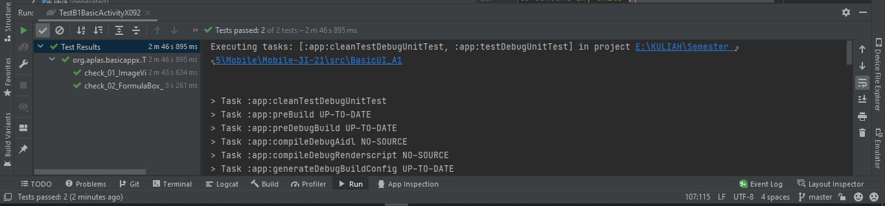

#  B1:Java - Basic Activity Java Edition - for Android Studio 4.x

## Tujuan Pembelajaran

1. Students create a Temperature class to convert unit.

## Hasil Praktikum

1. TASK GUIDE (B1X.01)

2. TASK GUIDE (B1X.02)

3. TASK GUIDE (B1X.03)

4. TASK GUIDE (B1X.04)

5. TASK GUIDE (B1X.01)

6. TASK GUIDE (B1X.06)

7. TASK GUIDE (B1X.07)

8. TASK GUIDE (B1X.08)

9. TASK GUIDE (B1X.09)

