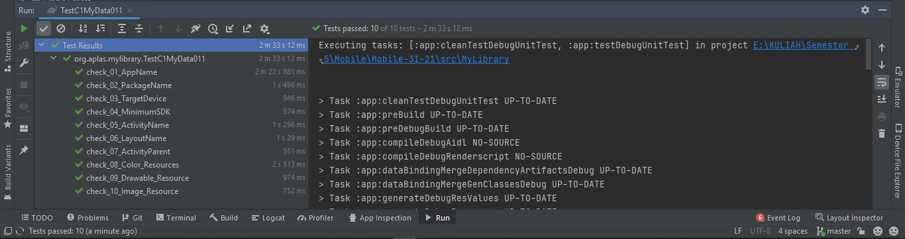
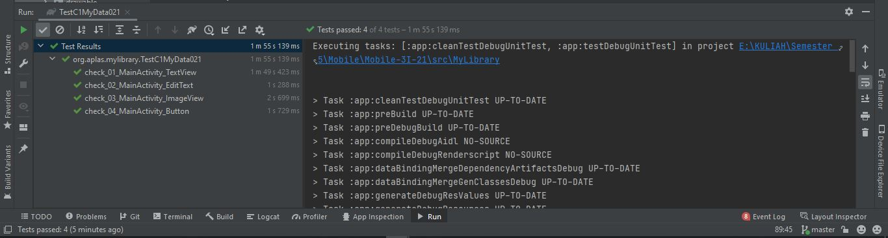
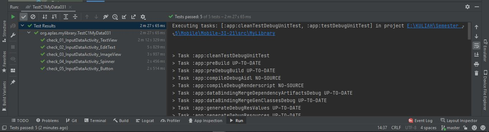
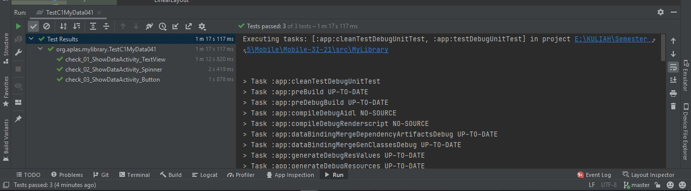
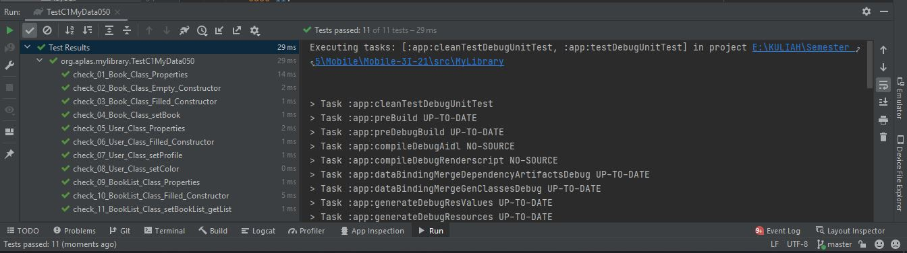
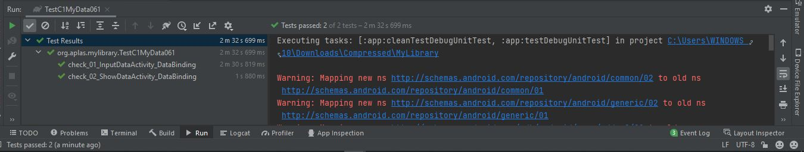
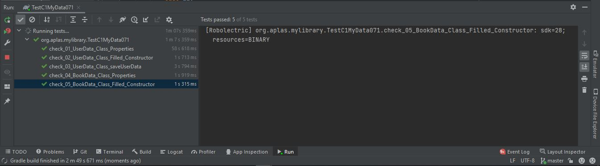
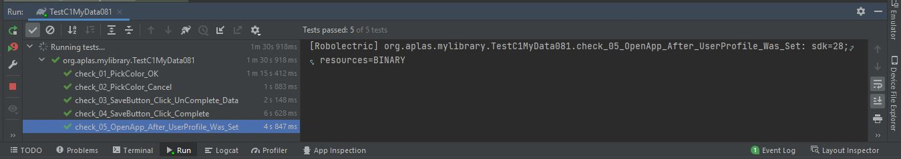
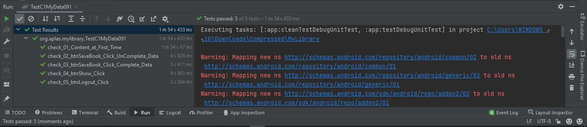
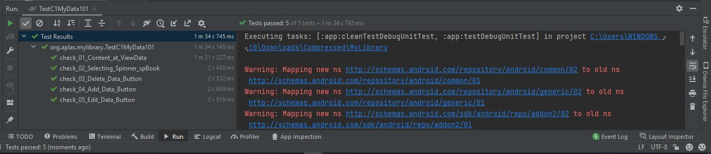

#  C1:Java - Advanced Widgets Java Edition - for Android Studio 4.x

## Hasil Praktikum

1. TASK GUIDE (C1X.01)

2. TASK GUIDE (C1X.02)

3. TASK GUIDE (C1X.03)

4. TASK GUIDE (C1X.04)

5. TASK GUIDE (C1X.05)

6. TASK GUIDE (C1X.06)

7. TASK GUIDE (C1X.07)

8. TASK GUIDE (C1X.08)

9. TASK GUIDE (C1X.08)

10. TASK GUIDE (C1X.08)

